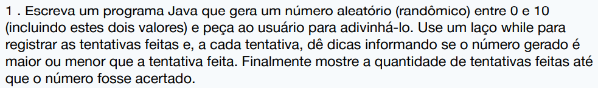
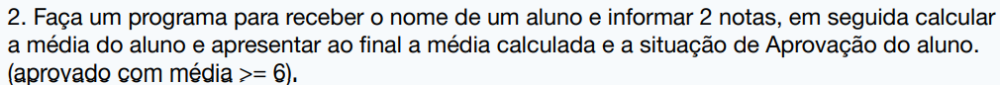
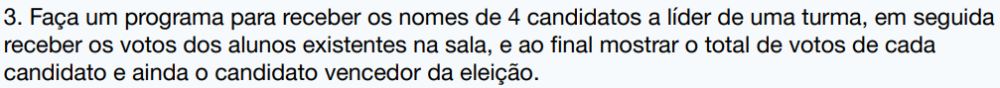

# Atividade - Estrutura de Repetição

Dia 2 de Abril

[Código da questão 01](https://github.com/israelld/Gama-and-Wipro/tree/main/Estrutura-de-Repeticao/Exercicio/src/one.java)

[Código da questão 02](https://github.com/israelld/Gama-and-Wipro/tree/main/Estrutura-de-Repeticao/Exercicio/src/two.java)

[Código da questão 03](https://github.com/israelld/Gama-and-Wipro/tree/main/Estrutura-de-Repeticao/Exercicio/src/three.java)
