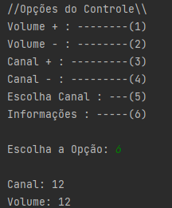
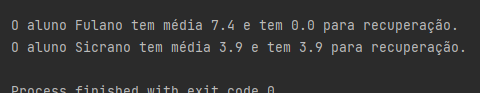
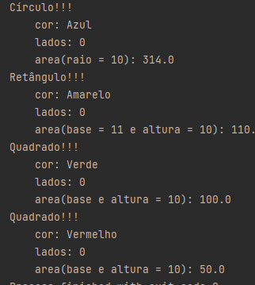
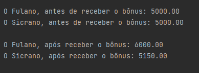

## Atividade Sobre Orientação a Objetos Com Java

### Exercício 01
O objetivo foi controlar um Objeto (Televisao) a partir de uma classe (ControleRemoto). Não é explicito que ControleRemoto também deveria ser um objeto, então, a classe principal se tornou o ControleRemoto para chamar os métodos do Objeto tv instanciado da Classe Televisao.

### Exercício 02

Neste exercício criamos uma classe que recebesse dados de um aluno em uma disciplina (matricula, nome, nota01, nota02 e notaTrabalho).

Criamos dois métodos:

media() para calcular a média ponderada do aluno sobre uma disciplina, onde as notas tem peso 1.5 e o trabalho tem peso 2;

e recuperacao() onde retorna zero se ele não for para a recuperação.

### Exercício 03

Aqui implementamos uma interface para as classes de formas geométricas tivesses a mesma estrutura base, já que todos tem um número de lados (circulo retorna 0), cor, mesmo parâmetro de calculo de área.

### Exercício 04

O objetivo desse exercício foi o que atribuir bonificações à duas classes que estendiam a classe de funcionário, ambas compartilham de todas as características da classe mãe. 

